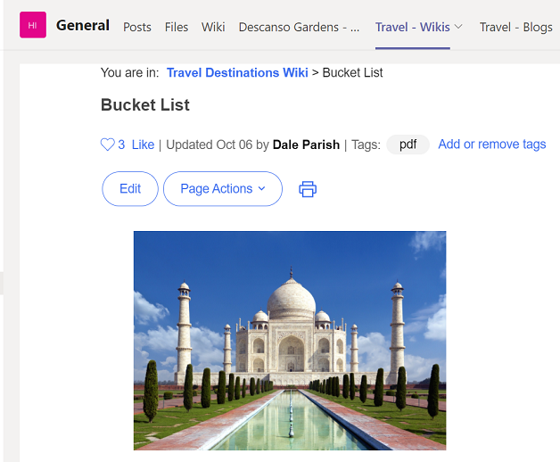
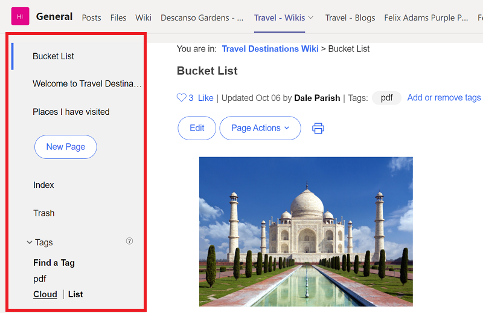

# Microsoft Teams Tab App - Hide Navigation
This example injects a customization to hide the default Connections navigation pane when a page, for example from a wiki, is embedded in a Teams tab at the top of a channel.

Instead, a small icon is added in the upper left that allows a user to expose the navigation if they so choose, but which is less intrusive in the overall content viewing experience.

**With Customization**  
Navigation panel is collapsed but icon is present to expand:  


**Without Customization**  
Default navigation panel is exposed and takes up space:  


The json from [ms-teams-collapse-sidebar.json](./ms-teams-collapse-sidebar.json) can either be imported from file or copied / pasted into the code editor of the appregistry client to create the extension.

The **collapse-sidebar/*** files (including the folder) should be copied into the **/pv-connections/customizations** folder on the Component Pack node so that the full path is **/pv-connections/customizations/collapse-sidebar/**. 

If the folder path is different for some reason, then remember to modify the folder path in the **include-files** attribute of the appregistry json (and relative to /pv-connections/customizations/):

```json
"include-files": [
                    "<newDir>/communities_sidebar_collapse.js"
                ],
```
